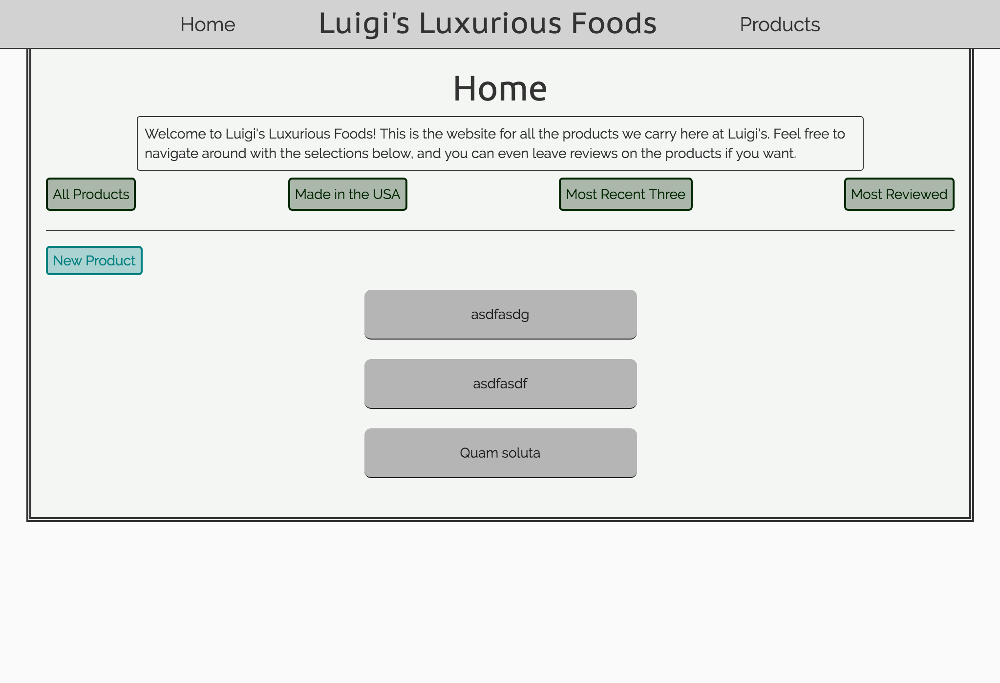

# Luigi's Luxurious Foods
### Steven Galvin, June 30th, 2017

This website was made using Ruby, version 2.4.1, and Rails, version 5.1. It's purpose is to allow the user to have CRUD functionality over products as well as reviews for those products. It uses scopes to organize products by most reviewed, or most recently added, and other similar filters. It also uses validations and callbacks to make sure the information is entered correctly and keeps errors to a minimum.

## Landing Page:

## Planning

### 1. Configuration/dependencies
  The app will primarily use Ruby on Rails and the SQL database. It was made with what I learned from week 1 of Epicodus' Rails course. Styled with bootstrap and SASS

  Future plans include:
  * Hosting the site live
  * Adding user authentication
  * Updating the style of the page

### 2. User Stories
  * As a user, I'd like to visit a page to see a list of all products.
  * As a user, I'd like to click a product and view it's details like cost, info, and country of origin.
  * As a user, I'd like the option to review a product leaving feedback and a rating.
  * As a user, I'd like to filter products by most reviewed, made in the US, or most recently added.
  * As an administrator, I want to add new products
  * As an administrator, I want to edit products
  * As an administrator, I need the option to delete a product
  * As an administrator, I want all inputs to have character limits to make sure data received doesn't exceed a certain amount

### 3. Integration
  * Root component/Index page.
  * Products page
  * Dynamic products pages with reviews

### 4. UX/UI
  * Include Bootstrap & SASS

### 5. Polish
  * Refactor code.
  * Delete unused code.
  * Make README awesome.

## Prerequisites

You will need the following things properly installed on your computer.

* [Git](https://git-scm.com/)
* [Node.js](https://nodejs.org/) (with NPM)
* [Ruby](https://www.ruby-lang.org/en/downloads/)
* [Rails](http://rubyonrails.org/)
* [Postgres](https://www.learnhowtoprogram.com/ruby/ruby-database-basics/installing-postgres-7fb0cff7-a0f5-4b61-a0db-8a928b9f67ef) (here's a good lesson online for setting it up)

## Installation

As of writing this README, these instructions work on MacOS.

* Run `$ git clone <this-repository-url>`
* Then `$ cd luigis-luxurious-foods`
* Once in the luigis-luxurious-foods folder, run bundle install to install gems, $ rails db:create to create the database, $ rails db:migrate to create the schema, $ rails db:seed to populate the database, and $ rails s to run the server. Then visit http://localhost:3000/ to view the app.
## Built With

* Ruby ~> 2.4.1
* Rails ~> 5.1
* SQL
* HTML
* CSS/SASS
* Bootstrap https://getbootstrap.com/
* Jquery https://jquery.com/
* Node
* Bower

## Authors

Steven Galvin

## License

MIT License

Copyright (c) Steven Galvin, 2017

Permission is hereby granted, free of charge, to any person obtaining a copy
of this software and associated documentation files (the "Software"), to deal
in the Software without restriction, including without limitation the rights
to use, copy, modify, merge, publish, distribute, sublicense, and/or sell
copies of the Software, and to permit persons to whom the Software is furnished to do so, subject to the following conditions:

The above copyright notice and this permission notice shall be included in all
copies or substantial portions of the Software.

THE SOFTWARE IS PROVIDED "AS IS", WITHOUT WARRANTY OF ANY KIND, EXPRESS OR
IMPLIED, INCLUDING BUT NOT LIMITED TO THE WARRANTIES OF MERCHANTABILITY,
FITNESS FOR A PARTICULAR PURPOSE AND NONINFRINGEMENT. IN NO EVENT SHALL THE
AUTHORS OR COPYRIGHT HOLDERS BE LIABLE FOR ANY CLAIM, DAMAGES OR OTHER
LIABILITY, WHETHER IN AN ACTION OF CONTRACT, TORT OR OTHERWISE, ARISING FROM,
OUT OF OR IN CONNECTION WITH THE SOFTWARE OR THE USE OR OTHER DEALINGS IN THE
SOFTWARE.
